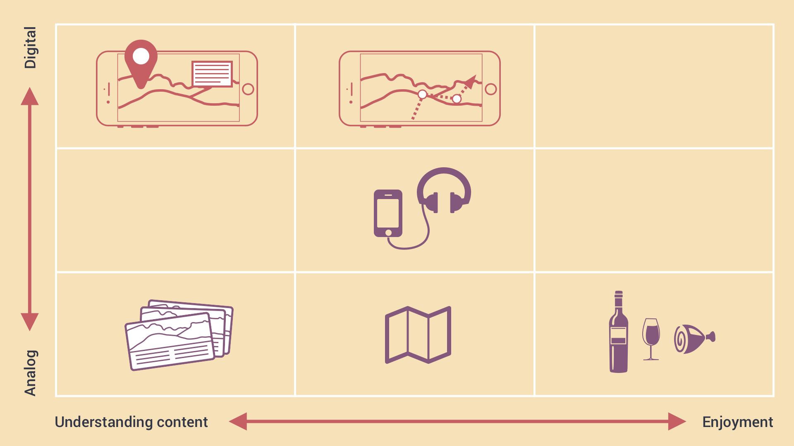
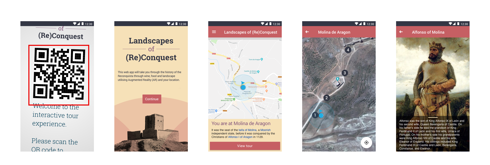
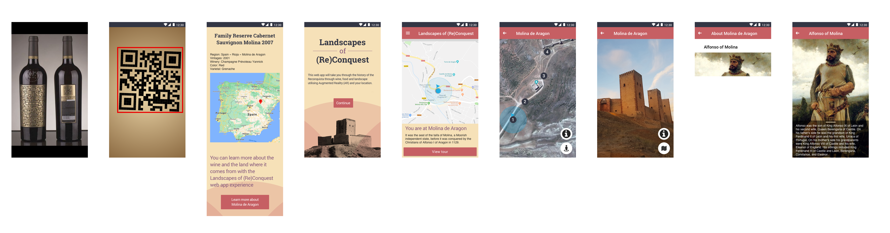

# WalkingTourClient
The client for the WalkingTour editor

https://jgl-walkingtour.glitch.me/

# The User Journey

While looking at the the context and use cases of the augmented reality tour, we reexamined some initial experience mapping that was done at the start of the project. What we want to design is an experience that does not emphasise looking at the screen, thus taking away the physical experience of the place and most importantly, leaves little to imagination.

In this case, we're looking at creating an extensible, accessible open source experience platform where location will activate media for the user. Here is an example of what it would look like where the user on-site would open media. Our first step is to have location open up the image in a browser on mobile, and then on to audio, video and finally mixed reality overlays.

We're thinking about ways to connect external or remote visitors through the experience of wine to the sites that produce that wine.

