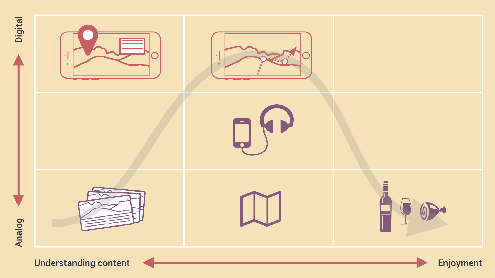

# WalkingTourClient
The client for the WalkingTourEditor available at:

https://github.com/JGL/WalkingTourEditor

WalkingTourClient is currently hosted on 
https://jgl-walkingtour.glitch.me/

# Installation Instructions

1. Install [Homebrew](https://brew.sh/) if on OSX or [Homebrew on Linux](https://docs.brew.sh/Homebrew-on-Linux) if on Linux or Windows (via [Windows Subsystem for Linux](https://docs.microsoft.com/en-us/windows/wsl/about)). Run "brew update" to ensure Homebrew is up to date. Then run "brew doctor" to make sure your system is ready to brew. Next, add Homebrew’s location to your $PATH in your .bash_profile or .zshrc file. "export PATH="/usr/local/bin:$PATH""
2. Install git via homebrew
3. Install node via homebrew
3. clone https://github.com/JGL/WalkingTourClient.git
4. cd into freshly created folder "WalkingTourClient"
5. run "npm install"
6. run "node server.js"
7. view the server via your favourite webrowser (likely defaults to localhost:3000)

# The User Journey

While looking at the the context and use cases of the augmented reality tour, we reexamined some initial experience mapping that was done at the start of the project. What we want to design is an experience that does not emphasise looking at the screen, thus taking away the physical experience of the place and most importantly, leaves little to imagination.

We've mapped out the experince on two axises, the vertical moving from analog to digital, and the horizontal from understanding content to enjoyment. This axis in particular is what we mean to support through the other. We want to create an enjoyable experience and see how we can mix that with providing historical context.

You can see the happy path here is a curve up from the bottom left up to the middle of the experience where the user is at the apex of digital experience and context awareness and visibility and then finally rounding out to the bottom right where they have learned about the situation, made the journey, aware of where they are and what happened there and then can enjoy the local wine and food.

# Ideas so far of how it could work and what it might look like

We're looking at creating an extensible, accessible open source experience platform where location will activate media for the user. Here is an example of what it would look like where the user on-site would open media. Our first step is to have location open up the image in a browser on mobile, and then on to audio, video and finally mixed reality overlays.

We're thinking about ways to connect external or remote visitors through the experience of wine to the sites that produce that wine.

